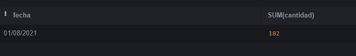

# desafio2_sql
 ```
--Creacion de la tabla "inscritos"
CREATE TABLE INSCRITOS(cantidad INT, fecha DATE, fuente VARCHAR);

--inster a tabla
INSERT INTO INSCRITOS(cantidad, fecha, fuente)
VALUES ( 44, '01/01/2021', 'Blog' );
INSERT INTO INSCRITOS(cantidad, fecha, fuente)
VALUES ( 56, '01/01/2021', 'Página' );
INSERT INTO INSCRITOS(cantidad, fecha, fuente)
VALUES ( 39, '01/02/2021', 'Blog' );
INSERT INTO INSCRITOS(cantidad, fecha, fuente)
VALUES ( 81, '01/02/2021', 'Página' );
INSERT INTO INSCRITOS(cantidad, fecha, fuente)
VALUES ( 12, '01/03/2021', 'Blog' );
INSERT INTO INSCRITOS(cantidad, fecha, fuente)
VALUES ( 91, '01/03/2021', 'Página' );
INSERT INTO INSCRITOS(cantidad, fecha, fuente)
VALUES ( 48, '01/04/2021', 'Blog' );
INSERT INTO INSCRITOS(cantidad, fecha, fuente)
VALUES ( 45, '01/04/2021', 'Página' );
INSERT INTO INSCRITOS(cantidad, fecha, fuente)
VALUES ( 55, '01/05/2021', 'Blog' );
INSERT INTO INSCRITOS(cantidad, fecha, fuente)
VALUES ( 33, '01/05/2021', 'Página' );
INSERT INTO INSCRITOS(cantidad, fecha, fuente)
VALUES ( 18, '01/06/2021', 'Blog' );
INSERT INTO INSCRITOS(cantidad, fecha, fuente)
VALUES ( 12, '01/06/2021', 'Página' );
INSERT INTO INSCRITOS(cantidad, fecha, fuente)
VALUES ( 34, '01/07/2021', 'Blog' );
INSERT INTO INSCRITOS(cantidad, fecha, fuente)
VALUES ( 24, '01/07/2021', 'Página' );
INSERT INTO INSCRITOS(cantidad, fecha, fuente)
VALUES ( 83, '01/08/2021', 'Blog' );
INSERT INTO INSCRITOS(cantidad, fecha, fuente)
VALUES ( 99, '01/08/2021', 'Página' );

--verifico si se ingreso correctamente
SELECT * FROM INSCRITOS;
 ```
 ```
--1) ¿Cuántos registros hay? 
SELECT COUNT(*) FROM INSCRITOS;
 ```
 
```
-- 2)¿Cuántos inscritos hay en total? 
SELECT SUM(cantidad) FROM inscritos;
```
 
```
--3)¿Cuál o cuáles son los registros de mayor antigüedad?
SELECT * FROM inscritos WHERE fecha = (SELECT MAX(fecha) FROM inscritos);
```

```
--4)¿Cuántos inscritos hay por día?
SELECT fecha, SUM(cantidad) FROM inscritos GROUP BY fecha;
```

```
--5)¿Cuántos inscritos hay por fuente?
SELECT fuente, SUM(cantidad) FROM inscritos GROUP BY fuente;
```

```
--6) ¿Qué día se inscribió la mayor cantidad de personas? Y ¿Cuántas personas se inscribieron en ese día?
SELECT fecha, SUM(cantidad) FROM inscritos GROUP BY fecha ORDER BY fecha DESC LIMIT 1;
```

```
--7) ¿Qué días se inscribieron la mayor cantidad de personas utilizando el blog? ¿Cuántas personas fueron?
SELECT fecha, SUM(cantidad) FROM inscritos WHERE fuente = 'Blog' GROUP BY fecha ORDER BY fecha DESC;
```

```
--8)¿Cuál es el promedio de personas inscritas por día?
SELECT fecha, AVG(cantidad) FROM inscritos GROUP BY fecha ORDER BY fecha DESC LIMIT 1;
```

```
--9) ¿Qué días se inscribieron más de 50 personas?
SELECT fecha, SUM(cantidad) FROM inscritos GROUP BY fecha HAVING SUM(cantidad) >= 50;
```

```
--10) ¿Cuál es el promedio diario de personas inscritas a partir del tercer día en adelante, considerando únicamente las fechas posteriores o iguales a la indicada?
SELECT fecha, AVG(cantidad) FROM inscritos WHERE fecha >= '01/03/2021' GROUP BY fecha ORDER BY fecha;
```


